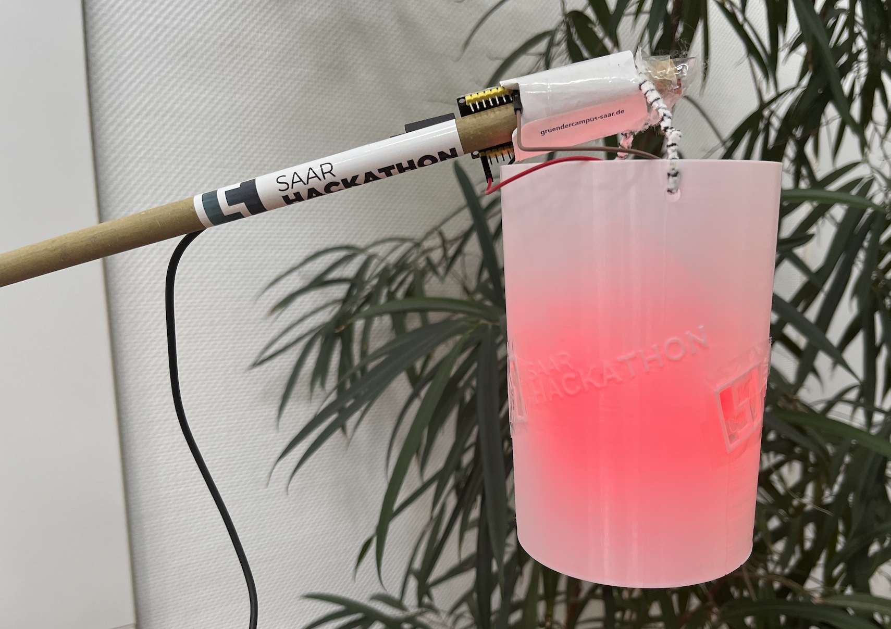
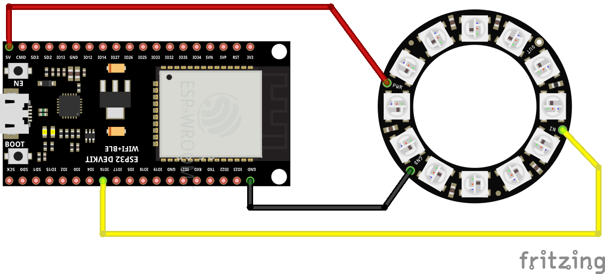
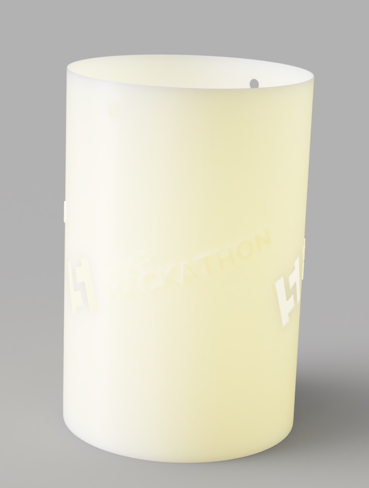
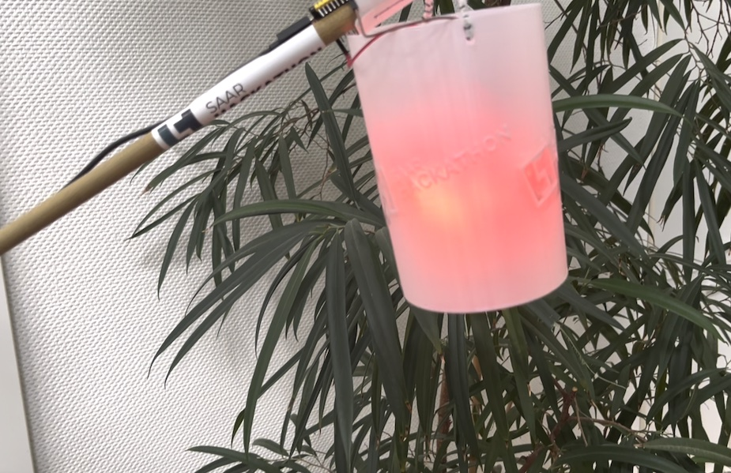
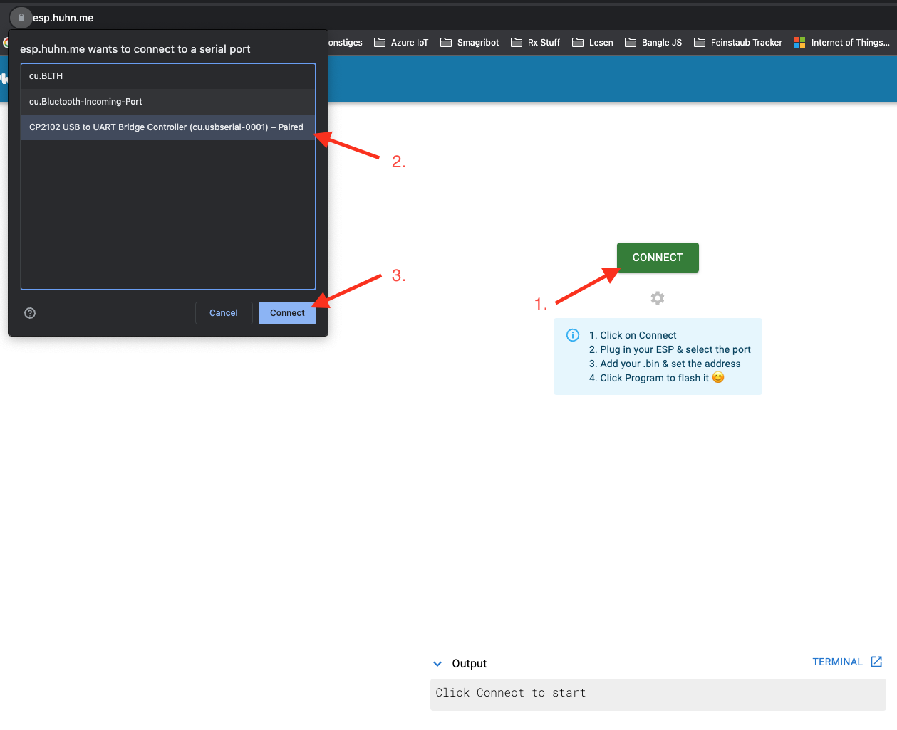
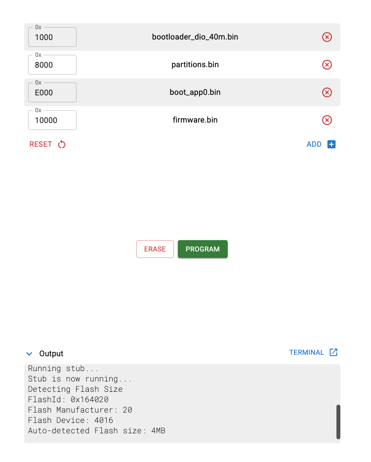
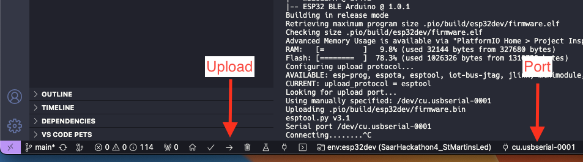

# Saar Hackathon #04 - St Martins LED



## Idee
~~WLAN~~ BLE Fähige LED St. Martins Laterne mit Microcontroller.
Als Controller Software wird WS2812FX und Arduino ESP32 Ble verwendet.

Laternen advertisen einen BLE-Service und gleichtzeitig scannen nach diesem.
Dadurch können die Laternen den Abstand zueinander ermitteln und verändern die Leucht animation.

# Hardware
ESP32 + WS2812 RGB LED (Strip) + 5V Powerbank + Lanterne

Beispiel Hardware:

- ESP32: https://www.berrybase.de/esp32-nodemcu-development-board
- Zum selber Löten: NeoPixel Ring mit 12 WS2812 5050 RGB LEDs https://www.berrybase.de/neopixel-ring-mit-12-ws2812-5050-rgb-leds
- Ohne Löten: seeed Grove - RGB LED Stick (10x WS2813) https://www.berrybase.de/seeed-grove-rgb-led-stick-10x-ws2813 und seeed Grove - Adapterkabel, 4 Pin Dupont Female - 4 Pin Grove Stecker, 5er Pack https://www.berrybase.de/seeed-grove-adapterkabel-4-pin-dupont-female-4-pin-grove-stecker-5er-pack

## Wie anschließen?


* PWR an 5V des ESP32
* GND auf GND
* DIN (Data in) auf Pin 16 (Ist mit IO16 oder G16 oder ähnlich auf dem Board benannt)

# 3D Model


<a href="lantern_model/SaarHackathonLantern.stl">SaarHackathonLantern.stl</a>

# Modi

## Keine Laterne in der Nähe: Rot


## Lanterne in der Nähe: Regenbogen
https://github.com/duglah/SaarHackathon4_StMartinsLed/assets/3907597/91483c53-8666-48b6-8741-02812c0bc819

## Lanternen berühren sich: PARRRTTTYYYY 🎉🥳
https://github.com/duglah/SaarHackathon4_StMartinsLed/assets/3907597/8d8949d4-4163-4ff2-8dfa-97adc51bd50c

# Wie kann ich das Programm auf den ESP32 flashen?

> **_⚠️WICHTIG:_** Wenn der ESP32 nicht erkannt wird ist meist der Treiber für den Serial-auf-USB Chip nicht installiert! 
> Auf den meisten ESP32 Entwicklungsboards befindet sich ein CP21x.#
>
> Den Treiber gibt es hier: https://www.silabs.com/developers/usb-to-uart-bridge-vcp-drivers 

## Über den Webbrowser:

Mit dem Tool von [spacehuhn](https://spacehuhn.com/) geht es ganz einfach!

> Klappt nur mit aktuellen Versionen der Browser auf dem Desktop Chrome, Edge oder Opera.
> (Mehr hier: https://developer.mozilla.org/en-US/docs/Web/API/Web_Serial_API#browser_compatibility )

1. https://esp.huhn.me/ öffnen und auf **connect** klicken

2. Im Menü das Board auswählen 


3. Auf **Connect** klicken
> Nicht sicher welche Auswahl das Board ist? Abstecken und nochmal schauen, welche Option fehlt!
>
> Wenn hier nichts auftaucht: Hast du die Treiber installiert? Siehe weiter oben!

> Wenn die Fehlermeldung `Error: Couldn't sync to ESP. Try resetting.` erscheint:
> Beim Verbinden den `BOOT` Knopf gedrückt halten

4. Die neusten Release-Datein (alle .bin-Dateien) herunterladen: https://github.com/duglah/SaarHackathon4_StMartinsLed/releases

5. Nun die Daten wie folgt angeben:
    * 0x100 bootloader_dio_40m.bin
    * 0x8000 partitions.bin
    * 0xE000 boot_app0.bin
    * 0x10000 firmware.bin
    

6. Auf **PROGRAM** klicken
7. Ein Dialog erscheint. Mit **Continue** bestätigen
8. Nun siehst du, dass die verschiedenen Dateien hochgeladen werden
9. Wenn alle übertragen wurde kannst du den `RESET`-Button auf dem Board klicken und die LEDs sollten leuchten

## Per Konsole
https://docs.espressif.com/projects/esptool/en/latest/esp32/installation.html

1. [Python 3.7](https://www.python.org/) oder neuer installieren, wenn noch nicht vorhanden
2. Mit pip esptool installieren: `python -m pip install esptool` bzw. `pip3 install esptool`
3. Hier die ggf. die Pfade und den Port anpassen: `python -m esptool --chip esp32 --port "/dev/cu.usbserial-0001" --baud 460800 --before default_reset --after hard_reset write_flash -z --flash_mode dio --flash_freq 40m --flash_size detect 0x1000 ./bootloader_dio_40m.bin 0x8000 ./partitions.bin 0xe000 ./boot_app0.bin 0x10000 ./firmware.bin` 

## Per VS Code un PlatformIO
1. VS code installieren: https://code.visualstudio.com/download
2. PlatformIO Extension installieren: https://marketplace.visualstudio.com/items?itemName=platformio.platformio-ide
3. Source Code des Projekts herunterladen und in VS Code öffnen
4. Unten in der Toolbar auf den Pfeil zum Upload klicken, ggf. den Port auswählen


# Code anpassen:

## Abstände anpassen:
Eigene Werte können in der Datei `src/led.hpp` in Zeile 16 und 17 angepasst werden:
```cpp
const int RSSI_THRESHOLD_CLOSE = -80;
const int RSSI_THRESHOLD_ADJACENT = -55;
```

Um so kleiner die Werte, um so weiter entfernt sind die Lampen.
Bitte beachten, dass z.B. Gegenstände, Menschen, etc. zwischen den Lampen das Signal auch dämpfen kann.

# Nur eine Laterne?
Wir empfehlen https://github.com/FastLED/FastLED zu installieren.
Hier öffnet des ESP32 ein Wlan und kann darüber gesteuert werden!